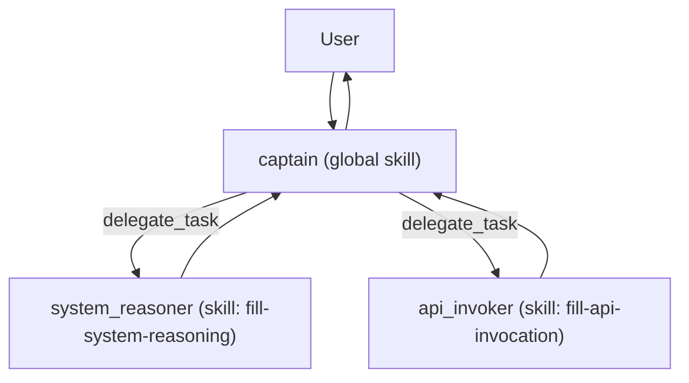
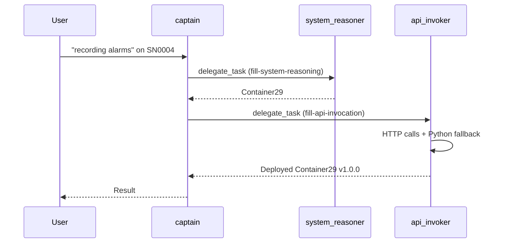

# From a Single Agent to a Small Society: A Lightweight Multi-Agent Architecture

## Abstract

This document describes a practical multi-agent design that stays lightweight while supporting complex, domain-specific workflows. The core idea is to keep every agent small, tool-capable, and skill-scoped. A coordinator (the "captain") uses a global skill to understand the domain and delegates specialized subtasks to sub-agents that load exactly one skill each. Skills are loaded dynamically and only when needed. We illustrate the approach with a real execution trace from the FILL system, using logs captured on 2026-02-07.

## Design goals

1. Keep agents lightweight and tool-capable so they can act, not just talk.
2. Keep context focused by loading only relevant skills per agent.
3. Separate concerns by delegating to specialized agents on demand.
4. Preserve auditability with structured logs.

## Lightweight agents with essential tools

Each agent runs with a minimal tool set that allows it to actually do work:

- Shell access for quick checks and system calls.
- Python execution for small, precise transformations.
- File I/O for reading and writing local artifacts.
- HTTP requests for calling external or internal APIs.

The key is not the number of tools, but that the set is sufficient. This keeps the agent's behavior predictable and keeps the model context small.

## Dynamic skill loading (and why it matters)

Instead of injecting every skill into every prompt, skills are treated like libraries:

- The captain loads the global `skills/SKILL.md` once per request for overall workflow guidance.
- The system maintains an overview list of all skills, extracted from the first section of each skill file.
- A sub-agent loads the full `SKILL.md` only when the captain delegates a task that needs it.

This is a pragmatic way to scale: each agent sees the smallest possible context that still contains the instructions it needs. That makes behavior more robust in difficult or ambiguous scenarios.

## Separation of concerns via delegation

The captain decides *what* to do; sub-agents decide *how* to do their specialized piece. Each sub-agent is strictly limited to **one skill**.

This separation has two advantages:

1. **Focus**: a sub-agent does not carry unrelated instructions.
2. **Reusability**: a sub-agent can be reused when a similar subtask appears again, without reloading or reinterpreting a broad skill set.

## Architecture overview



- The captain sees the global skill, chooses which specialized agents to spin up, and composes the final response.
- Workers stay specialized and only load a single skill.

## What this looks like in practice: the FILL example

Below is a real execution trace (see `agent/logs/2026-02-07.log`) where the user asked to enable the "recording alarms" capability on a machine with serial number `SN0004`.

### Step 1: Captain delegates reasoning

The captain asks a `system_reasoner` agent to map the intent to the required workload container.

From the log:

```
{"event":"tool_invocation","agent":"captain","tool":"delegate_task","args":{"agent_name":"system_reasoner","skill_name":"fill-system-reasoning","task":"User intent: enable 'recording alarms' capability on machine with Serial Number SN0004..."}}
```

The `system_reasoner` loads the `fill-system-reasoning` skill and returns a single container name:

```
{"event":"agent_message","from":"system_reasoner","to":"captain","content":"Container29"}
```

### Step 2: Captain delegates API execution

Next, the captain delegates deployment to the `api_invoker` agent, which loads the `fill-api-invocation` skill.

From the log:

```
{"event":"tool_invocation","agent":"captain","tool":"delegate_task","args":{"agent_name":"api_invoker","skill_name":"fill-api-invocation","task":"API host: http://fill_app:3000... Deploy the latest available version..."}}
```

### Step 3: The API agent resolves versions and deploys

The `api_invoker` performs a series of API calls:

- `GET /workloads` to locate `Container29`
- `GET /workloads/<id>/versions` to find the latest version
- `PUT /nerve/dna/SN0004/target` to deploy

When the initial `PUT` attempts fail due to payload format, the agent pivots to a YAML payload via Python and succeeds:

```
{"event":"tool_result","agent":"api_invoker","tool":"run_python","result":{"stdout":"202\n{\"message\":\"DNA configuration accepted and will be applied\"}\n"}}
```

### Step 4: The captain returns the result

The `api_invoker` reports success:

```
{"event":"agent_message","from":"api_invoker","to":"captain","content":"Available versions for Container29: 1.0.0\n\nDeployed Container29 version 1.0.0 to SN0004 — status: 202 Accepted — message: DNA configuration accepted and will be applied"}
```

The captain then responds to the user.

## Event trace structure (logging)

Every meaningful interaction is logged with a timestamp:

- `agent_created`, `agent_killed`
- `agent_message` (agent-to-agent communication)
- `tool_invocation`, `tool_result`
- `skill_loaded`

A simplified timeline for the FILL example:



## Why this design scales

1. **Context stays clean**: only one skill per worker agent.
2. **Skills are reusable**: workers persist until explicitly killed.
3. **Auditability**: logs are detailed enough to explain every decision.
4. **Extensibility**: adding a new skill creates a new specialization without touching the core agent.

## Closing thoughts

A multi-agent system does not have to be heavyweight. By combining small tool-capable agents with dynamic skill loading and strict separation of concerns, you get a system that is easy to understand, easy to audit, and powerful in practice. The FILL example demonstrates that the approach handles real-world ambiguity while keeping the cognitive load of each agent low.
